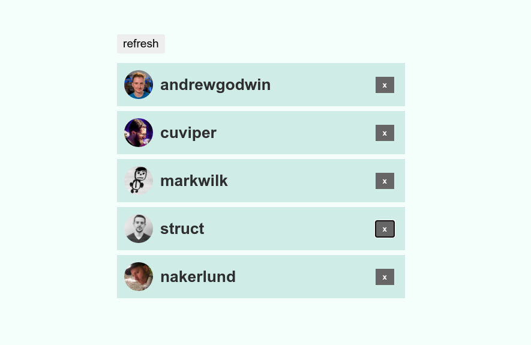

# svelte-rxjs-intro-frp

Introduction to Svelte and RxJS by recreating a classing FRP tutorial:

[The introduction to Reactive Programming you've been missing](https://gist.github.com/staltz/868e7e9bc2a7b8c1f754)

This is the code for the accompanying article at my blog:

[Recreating a classic FRP tutorial with Svelte and RxJS](https://codechips.me/classic-frp-tutorial-with-svelte-rxjs-6/)

## Final result



## Getting started

```text
$ git clone git@github.com:codechips/svelte-rxjs-intro-frp.git
$ cd svelte-rxjs-intro-frp
$ npm i && npm start
```
## Additional Info

There are two examples of the same code:

- The original version in `original-solution` branch - same solution as in original tutorial
- The dynamic version in `master` branch - my dynamic solution

## There is more!

For more interesting stuff like this follow me on [Twitter](https://twitter.com/codechips) or check out my blog https://codechips.me

